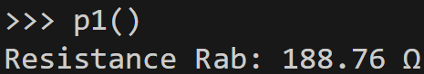
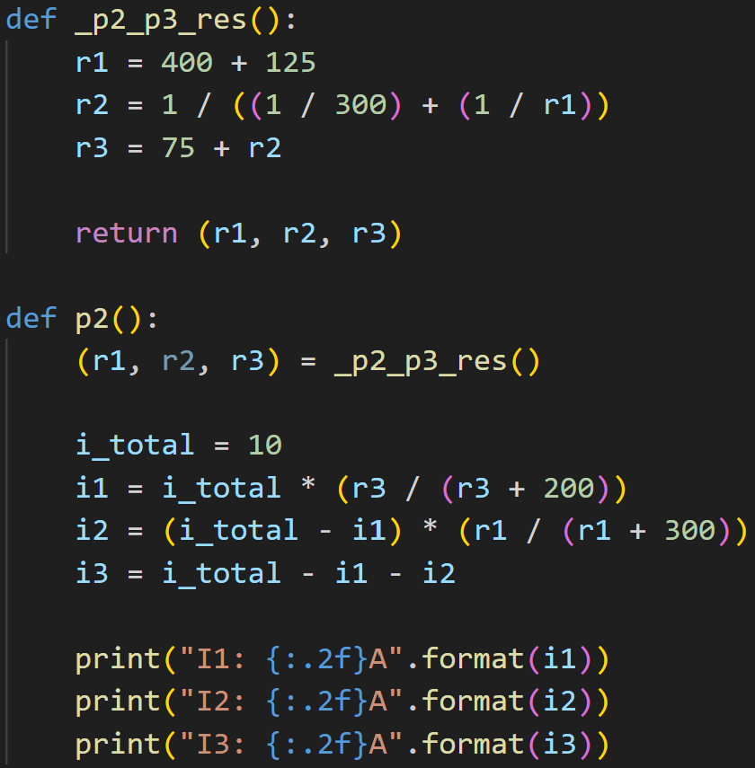
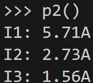
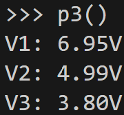
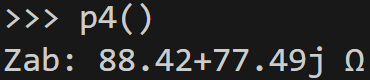

# 1)
## Code
{ width=425px }

## Output
{ width=225 }

 

# 2)
## Code
{ width=350 }

## Output
{ width=100px }

 

# 3)
## Code
{ width=300 }

 

{ width=300 }

## Output
{ width=100 }

 

# 4)
## Code
{ width=300 }

## Output
{ width=200 }

 