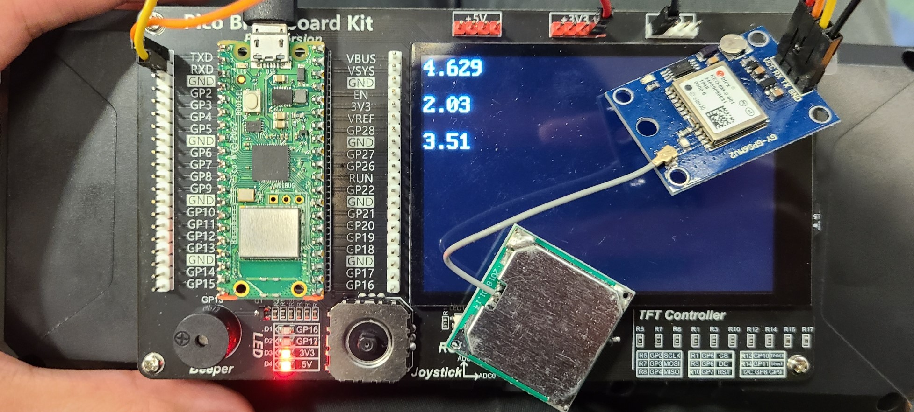

# 1) How Fast Can You Run?
## Program

### gps6m.py
```py
from machine import UART

_KNOTS_TO_M_PER_S = 0.514444

class GPS6M:
    def __init__(self, uart: UART):
        self._uart = uart

    def try_read_speed_m_per_s(self):
        # simpler error handling in case of invalid msg or cast
        try:
            msg = self._read_line()
            msg_values = msg.split(',')
            if msg_values[0] == "$GPRMC":
                return (float(msg_values[7]) * _KNOTS_TO_M_PER_S)
            else:
                raise Exception

        except:
            return 0.0

    def _read_line(self):
        flag = 0
        msg = ''
        while(flag == 0):
            x = self._uart.read(1)
            if(x != None):
                x = ord(x)
            else:
                raise Exception("No gps msg received")

            if(chr(x) == '$'):
                msg = ''
            if(x == 13):
                flag = 1
            else:
                msg = msg + chr(x)
        return(msg)
```

### speed_tester.py
```py
import st7796
from gps6m import GPS6M
from machine import Pin, Timer

_READ_PERIOD_MS = const(100)

_RGB_BLACK = st7796.RGB(0, 0, 0)
_RGB_WHITE = st7796.RGB(255, 255, 255)

class SpeedTester:
    def __init__(self, gps: GPS6M, start_button: Pin, stop_button: Pin):
        self._gps = gps
        self._top_speeds = [0.0, 0.0, 0.0]
        self._recording_top_speed = 0.0
        st7796.Init()
        st7796.Clear(_RGB_BLACK)
        self._start_button = start_button
        self._stop_button = stop_button
        self._read_timer = Timer()
        self._start_button.irq(trigger=Pin.IRQ_FALLING, handler=self._start_handler)
        self._stop_button.irq(trigger=Pin.IRQ_FALLING, handler=self._stop_handler)

    def _start_handler(self, pin: Pin):
        self._read_timer.init(mode=Timer.PERIODIC, period=_READ_PERIOD_MS, callback=self._read_handler)

    def _stop_handler(self, pin: Pin):
        self._read_timer.deinit()
        lowest_top_speed = min(self._top_speeds)
        index = self._top_speeds.index(lowest_top_speed)
        if self._recording_top_speed > self._top_speeds[index]:
            self._top_speeds[index] = self._recording_top_speed

        # Reset top speed for the next recording
        self._recording_top_speed = 0.0
        self._update_lcd()

    def _update_lcd(self):
        offset = 0
        for i in range(len(self._top_speeds)):
            st7796.Text2("     ", 0, offset, _RGB_WHITE, _RGB_BLACK)
            speed_str = str(self._top_speeds[i])
            st7796.Text2(speed_str, 0, offset, _RGB_WHITE, _RGB_BLACK)

            offset += 50

    def _read_handler(self, timer: Timer):
        speed = self._gps.try_read_speed_m_per_s()
        if speed > self._recording_top_speed:
            self._recording_top_speed = speed
```

### main.py
```py
from gps6m import GPS6M
from machine import Pin, UART
from speed_tester import SpeedTester

if __name__ == "__main__":

    # Init peripherals
    gps_uart = UART(0, 9600)
    gps_uart.init(9600, bits=8, parity=None, stop=1, tx=0, rx=1)
    gps = GPS6M(uart=gps_uart)

    start_button = Pin(15, Pin.IN, Pin.PULL_UP)
    stop_button = Pin(14, Pin.IN, Pin.PULL_UP)

    # Instantiate speedtester object
    tester = SpeedTester(gps=gps, start_button=start_button, stop_button=stop_button)

    while True:
        continue
```

## Test

Results after hooking the Pico board up to a battery and doing an unsuspicious short jog outside at night while dressed in black

(Results in meters/second)

