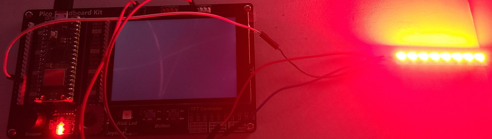

# 1) NeoPixel
## Program
### p1.py
```py
from machine import Pin, Timer
from neopixel import NeoPixel

class StarterTree:
    def __init__(self, start_button: Pin, clear_button: Pin, np_pin: Pin, num_neopixels: int=8, bpp: int=3, timing: int=1):
        self._np = NeoPixel(np_pin, num_neopixels, bpp=3, timing=1)
        self._current_np = 0
        self._num_neopixels = num_neopixels
        self._timer = Timer()
        self._start_button = start_button
        self._start_button.irq(handler=self._start_handler, trigger=Pin.IRQ_FALLING) #type: ignore
        self._clear_button = clear_button
        self._clear_button.irq(handler=self._clear_handler, trigger=Pin.IRQ_FALLING) #type: ignore

    def _start_handler(self, pin: Pin):
        self._timer.init(mode=Timer.PERIODIC, period=1000, callback=self._tree_handler)

    def _clear_handler(self, pin: Pin):
        self._np.fill((0,0,0))
        self._np.write()

    def _tree_handler(self, timer: Timer):
        self._np[self._current_np] = (255, 0, 0) #type: ignore
        self._np.write()
        self._current_np = (self._current_np + 1) % self._num_neopixels
        if self._current_np == 0:
            self._timer.deinit()

if __name__ == "__main__":
    start_button = Pin(15, Pin.IN, Pin.PULL_UP)
    clear_button = Pin(14, Pin.IN, Pin.PULL_UP)
    tree = StarterTree(start_button=start_button, clear_button=clear_button, np_pin=Pin(11))

    while True:
        continue
```

## Test

Code works



<br>

# 2) Pico Webpage over WiFi
## Program
### p2.py
```py
import network, socket
from machine import Pin, Timer
from neopixel import NeoPixel

class StarterTree:
    def __init__(self, start_button: Pin, clear_button: Pin, np_pin: Pin, num_neopixels: int=8, bpp: int=3, timing: int=1):
        self._np = NeoPixel(np_pin, num_neopixels, bpp=3, timing=1)
        self._current_np = 0
        self._num_neopixels = num_neopixels
        self.web_page = """
            <!DOCTYPE html>
            <html>
            <head>
            <title>Page Title</title>
            </head>
            <body>

            <h1>Neopixel</h1>
            <p>0 lights on</p>

            <form action="/action_page.php" method="get">
                <button name="action" value="refresh" type="submit">Refresh</button>
            </form>

            </body>
            </html>
        """
        self._timer = Timer()
        self._start_button = start_button
        self._start_button.irq(handler=self._start_handler, trigger=Pin.IRQ_FALLING) #type: ignore
        self._clear_button = clear_button
        self._clear_button.irq(handler=self._clear_handler, trigger=Pin.IRQ_FALLING) #type: ignore

    def _start_handler(self, pin: Pin):
        self._timer.init(mode=Timer.PERIODIC, period=1000, callback=self._tree_handler)

    def _clear_handler(self, pin: Pin):
        self._np.fill((0,0,0))
        self._np.write()
        self.web_page = """
            <!DOCTYPE html>
            <html>
            <head>
            <title>Page Title</title>
            </head>
            <body>

            <h1>Neopixel</h1>
            <p>0 lights on</p>

            <form action="/action_page.php" method="get">
                <button name="action" value="refresh" type="submit">Refresh</button>
            </form>

            </body>
            </html>
        """
        self._current_np = 0

    def _tree_handler(self, timer: Timer):
        self._np[self._current_np] = (255, 0, 0) #type: ignore
        self._np.write()
        self.web_page = self.web_page.replace("{}".format(self._current_np), "{}".format(self._current_np+1))
        self._current_np = (self._current_np + 1) % self._num_neopixels
        if self._current_np == 0:
            self._timer.deinit()

if __name__ == "__main__":
    ssid = 'Pico-Network'
    password = 'PASSWORD'
    start_button = Pin(15, Pin.IN, Pin.PULL_UP)
    clear_button = Pin(14, Pin.IN, Pin.PULL_UP)
    ap = network.WLAN(network.AP_IF)
    ap.config(essid=ssid, password=password)
    ap.active(True)
    while ap.active() == False:
        pass
    print('AP Mode Is Active, You can Now Connect')
    print('IP Address To Connect to:: ' + ap.ifconfig()[0])
    s = socket.socket(socket.AF_INET, socket.SOCK_STREAM)
    s.bind(('', 80))
    s.listen(5)
    tree = StarterTree(start_button=start_button, clear_button=clear_button, np_pin=Pin(11))
    while True:
        conn, addr = s.accept()
        print('Got a connection from %s' % str(addr))
        request = conn.recv(1024)
        print('Content = %s' % str(request))
        conn.send(tree.web_page)
        conn.close()
```

<br>

## Test

[https://www.youtube.com/watch?v=fJ07boctktc](https://www.youtube.com/watch?v=fJ07boctktc)

Click image to access video

[](https://www.youtube.com/watch?v=fJ07boctktc)

<br>

# 3) Pico NeoPixel Web Control
## Program
### p3.py
```py
import network, socket
from machine import Pin, Timer
from neopixel import NeoPixel

class StarterTree:
    def __init__(self, np_pin: Pin, num_neopixels: int=8, bpp: int=3, timing: int=1):
        self._np = NeoPixel(np_pin, num_neopixels, bpp=3, timing=1)
        self._current_np = 0
        self._num_neopixels = num_neopixels
        self.web_page = """
            <!DOCTYPE html>
            <html>
            <head>
            <title>Page Title</title>
            </head>
            <body>

            <h1>Neopixel</h1>
            <p>0 lights on</p>

            <form action="/action_page.php" method="get">
                <button name="action" value="start" type="submit">Start</button>
                <button name="action" value="clear" type="submit">Clear</button>
                <button name="action" value="refresh" type="submit">Refresh</button>
            </form>

            </body>
            </html>
        """
        self._timer = Timer()

    def start(self):
        self._timer.init(mode=Timer.PERIODIC, period=1000, callback=self._tree_handler)

    def clear(self):
        self._np.fill((0,0,0))
        self._np.write()
        self.web_page = """
            <!DOCTYPE html>
            <html>
            <head>
            <title>Page Title</title>
            </head>
            <body>

            <h1>Neopixel</h1>
            <p>0 lights on</p>

            <form action="/action_page.php" method="get">
                <button name="action" value="start" type="submit">Start</button>
                <button name="action" value="clear" type="submit">Clear</button>
                <button name="action" value="refresh" type="submit">Refresh</button>
            </form>

            </body>
            </html>
        """
        self._current_np = 0

    def _tree_handler(self, timer: Timer):
        self._np[self._current_np] = (255, 0, 0) #type: ignore
        self._np.write()
        self.web_page = self.web_page.replace("{}".format(self._current_np), "{}".format(self._current_np+1))
        self._current_np = (self._current_np + 1) % self._num_neopixels
        if self._current_np == 0:
            self._timer.deinit()

    def handle_request(self, request):
        # Parse the request
        if "?action=start" in request:
            self.start()
        elif "?action=clear" in request:
            self.clear()

if __name__ == "__main__":
    ssid = 'Pico-Network'
    password = 'PASSWORD'
    start_button = Pin(15, Pin.IN, Pin.PULL_UP)
    clear_button = Pin(14, Pin.IN, Pin.PULL_UP)
    ap = network.WLAN(network.AP_IF)
    ap.config(essid=ssid, password=password)
    ap.active(True)
    while ap.active() == False:
        pass
    print('AP Mode Is Active, You can Now Connect')
    print('IP Address To Connect to:: ' + ap.ifconfig()[0])
    addr = socket.getaddrinfo("0.0.0.0", 80)[0][-1]
    s = socket.socket(socket.AF_INET, socket.SOCK_STREAM)
    s.bind(addr)
    s.listen(5)
    tree = StarterTree(np_pin=Pin(11))
    while True:
        conn, addr = s.accept()
        print('Got a connection from %s' % str(addr))
        request = conn.recv(1024).decode()
        tree.handle_request(request)
        print('Content = %s' % str(request))
        conn.send(tree.web_page)
        conn.close()
```

<br>

## Test

[https://www.youtube.com/watch?v=oH6zSjSDndU](https://www.youtube.com/watch?v=oH6zSjSDndU)

Click image to access video

[](https://www.youtube.com/watch?v=oH6zSjSDndU)