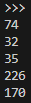
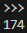
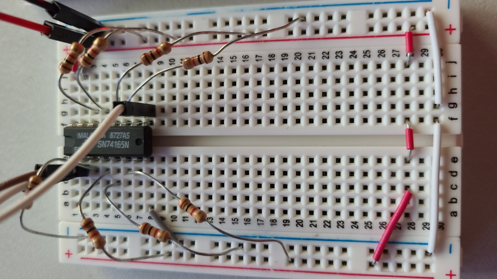
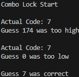
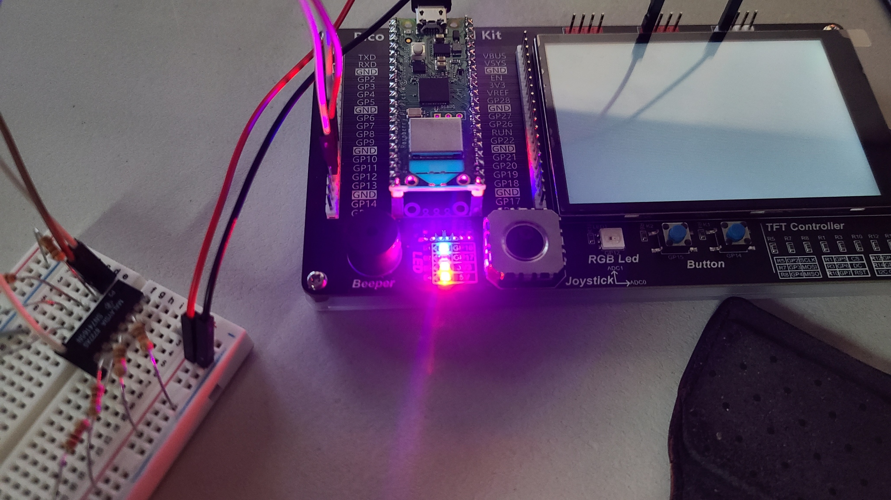

# Binary I/O
## 1) leds.py
### **Program**
```py
from machine import Pin

if __name__ == "__main__":
    button1 = Pin(15, Pin.IN, Pin.PULL_UP)
    button2 = Pin(14, Pin.IN, Pin.PULL_UP)
    led1 = Pin(16, Pin.OUT)
    led2 = Pin(17, Pin.OUT)

    while True:
        led1.value((1 - button1.value()) & (1 - button2.value()))
        led2.value((1 - button1.value()) ^ (1 - button2.value()))
```

<br>

### **Test**
Click image to access video
<br>

[](https://www.youtube.com/watch?v=fqOfEFV8fvA)

<div style="page-break-after: always;"></div>

## 2) counter.py
### **Program**
```py
import _thread
from machine import Pin

class ButtonCounter():
    """
    Increment a counter when an IRQ interrupt is triggered.

    :param int button_pin: Button GPIO pin
    :param int button_pull: Specify if the pin has a pull resistor attached
    :param int trigger: The IRQ event that triggers an interrupt
    :param list[int] counter_ptr: Pointer to the counter
    :param int increment: Increment size
    :param lock: lock object to prevent simulatenous access to shared resource.
    """
    def __init__(
            self, 
            button_gpio: int, 
            button_pull: int, 
            trigger:int, 
            counter_ptr: list[int], 
            increment: int,
            lock
        ):

        self._button = Pin(button_gpio, Pin.IN, button_pull)
        self._button.irq(trigger=trigger, handler=self._button_callback)
        self._counter_ptr = counter_ptr
        self._increment = increment
        self._lock = lock

    def _button_callback(self, pin: Pin):
        with self._lock:
            self._counter_ptr[0] += self._increment

if __name__ == "__main__":
    """Counter Program"""
    counter_ptr = [0]
    lock = _thread.allocate_lock()
    
    # Configure button counter objects to increment when buttons are let go
    ButtonCounter(15, Pin.PULL_UP, Pin.IRQ_RISING, counter_ptr, 10, lock)
    ButtonCounter(14, Pin.PULL_UP, Pin.IRQ_RISING, counter_ptr, 1, lock)

    while True:
        print(counter_ptr[0])
```

<br>

### **Test**
Click image to access video
<br>

[](https://www.youtube.com/watch?v=4eU21yN7zWA)


<div style="page-break-after: always;"></div>

# Combination Lock
## 3) rand.py
### **Program**
```py
from random import randrange

NUM_TESTS = 5

def randnum() -> int:
    """Return a random number between 0 and 255"""
    return randrange(0, 256)

if __name__ == "__main__":
    """Test Script"""
    for _ in range(0, NUM_TESTS):
        print(randnum())
```

<br>

### **Test**


<br>

## 4) sn74165n.py
### **Program**
```py
import time
from machine import Pin

class SN74165N():
    """
    SN74165N Shift Register
    
    :param Pin clock: Serial clock
    :param Pin load: Loads and shifts the shift register's parallel inputs
    :param Pin rx: Serial receive
    """
    def __init__(self, clk_gpio: int, ld_gpio: int, rx_gpio: int):
        self._clock = Pin(clk_gpio, Pin.OUT)
        self._load = Pin(ld_gpio, Pin.OUT)
        self._rx = Pin(rx_gpio, Pin.IN)

    def read(self) -> int:
        """Read the 8-bit input of a 74LS165 shift register using bit banging"""
        # Temporarily pull load pin down
        self._load.value(1)
        self._clock.value(0)
        time.sleep_ms(100)
        self._load.value(0)
        time.sleep_ms(100)
        self._load.value(1)
        # data is latched - now shift it in
        X = 0
        for i in range(0,8):
            self._clock.value(0)
            time.sleep_ms(100)
            X = (X << 1) + self._rx.value()
            self._clock.value(1)
            time.sleep_ms(100)
        
        return(X)
    
if __name__ == "__main__":
    """Test Script"""
    shiftreg = SN74165N(clk_gpio=10, ld_gpio=9, rx_gpio=12)
    print(shiftreg.read())
```

<br>

### **Test**

174 is 0b10101110





<div style="page-break-after: always;"></div>

## 5) combo_lock.py
### **Program**
```py
from machine import Pin
from sn74165n import SN74165N
from rand import randnum

if __name__ == "__main__":
    """Combo Lock Program"""

    #Init SN74165N, button, and led
    shiftreg = SN74165N(clk_gpio=10, ld_gpio=9, rx_gpio=12)
    button = Pin(15, Pin.IN, Pin.PULL_UP)
    led = Pin(16, Pin.OUT)

    print("Combo Lock Start\n")
    guess_result = ""
    rand_int = randnum()
    guess = -1
    led.off()
    while guess != rand_int:
        while button.value():
            continue

        guess = shiftreg.read()

        if guess == rand_int:
            guess_result = "correct"
            led.on()
        elif guess > rand_int:
            guess_result = "too high"
        else:
            guess_result = "too low"
        
        if guess != rand_int:
            print("Actual Code: {}".format(rand_int))

        print("Guess {} was {}\n".format(guess, guess_result))
```

<div style="page-break-after: always;"></div>

### **Test**


LED turns on
