# Electronic Trombone
## 1) main.py
```py
from machine import Pin, ADC, PWM

MAX_U16 = (2 ** 16) - 1
HALF_U16 = round(MAX_U16 / 2)

MIN_FREQ = 220
MAX_FREQ = 440

FREQ_FACTOR = (MAX_FREQ - MIN_FREQ) / MAX_U16

V_REF = 3.3

VOLT_FACTOR = V_REF / MAX_U16

BUTTON_GPIO = 14
ADC_PORT = 0
SPEAKER_GPIO = 28

if __name__ == "__main__":
    play_btn = Pin(BUTTON_GPIO, Pin.IN, Pin.PULL_UP)
    joystick = ADC(ADC_PORT)
    trombone = PWM(Pin(SPEAKER_GPIO, Pin.OUT))
    trombone.duty_u16(0)
    trombone_is_on = False
    
    while True:
        if play_btn.value() == 0:
            js_adc_val = joystick.read_u16()
            freq = round(js_adc_val * FREQ_FACTOR) + MIN_FREQ
            freq = max(min(freq, MAX_FREQ), MIN_FREQ)
            trombone.freq(freq)
            if not trombone_is_on:
                trombone.duty_u16(HALF_U16)
                trombone_is_on = True

            voltage = round(js_adc_val * VOLT_FACTOR)
            print("Frequency: {}, Voltage: {:.2f}".format(freq, voltage))
        
        elif trombone_is_on:
            trombone.duty_u16(0)
            trombone_is_on = False
```

<br>

## 2) Test

Joystick all the way left (223 Hz)

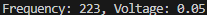

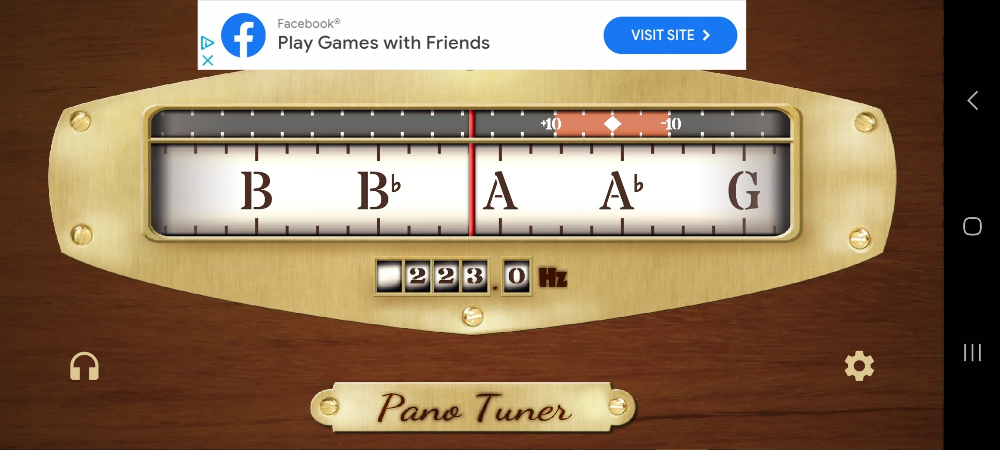

Joystick center (316.3 Hz)

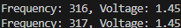

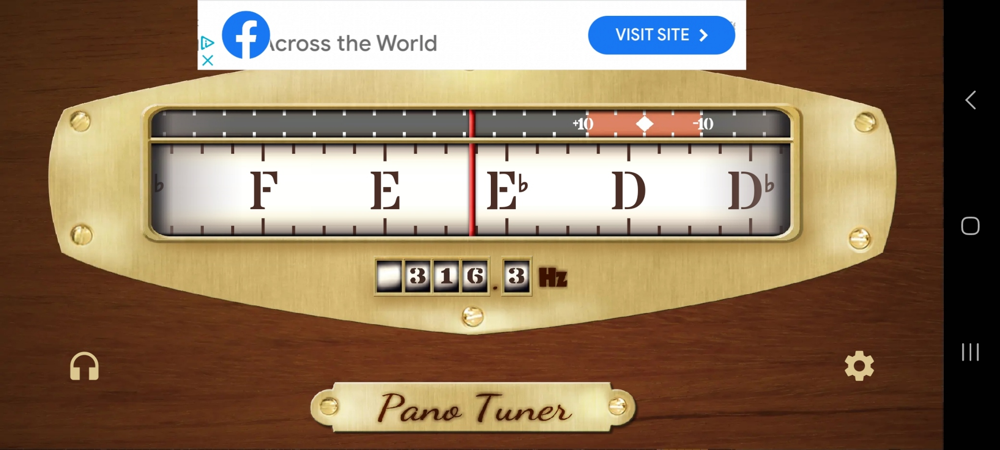

Joystick all the way right (422 Hz)

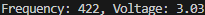

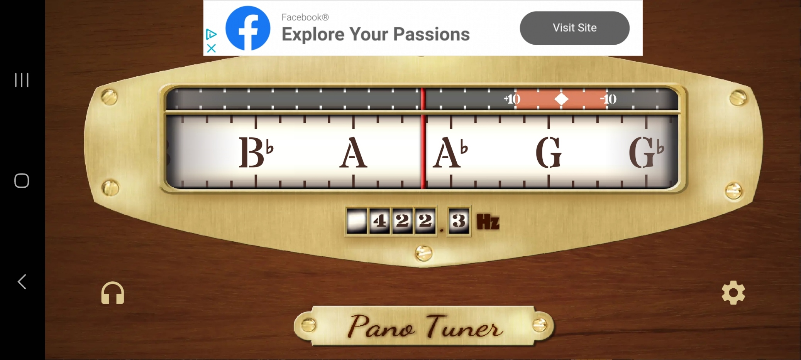

Note: Joystick has some drift

<br>

## 3) Demo

[https://www.youtube.com/watch?v=fMmqbfbh6s4](https://www.youtube.com/watch?v=fMmqbfbh6s4)

Click image to access video

[](https://www.youtube.com/watch?v=fMmqbfbh6s4)

<div style="page-break-after: always;"></div>

# Electronic Sunflower
## 4) Hardware

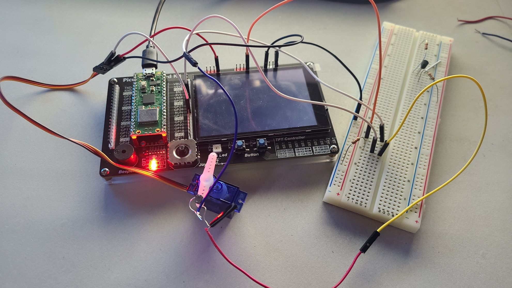

The LDR is attached to the servo motor and is connected to a pull up resistor.

<br>

## 5) servo.py
### **Program**
```py
from machine import Pin, PWM

class ServoMotor():
    """Servo Motor"""

    MIN_FREQ_HZ = 50
    MAX_FREQ_HZ = 330

    MIN_ANGLE = 0
    MAX_ANGLE = 270
    _MIN_PW_NS = 500_000
    _MAX_PW_NS = 2_500_000

    _PW_FACTOR = (_MAX_PW_NS - _MIN_PW_NS) / MAX_ANGLE

    def __init__(self, pwm_gpio: int):
        """
        Initialize the ServoMotor object
        
        :param int pwm_gpio: PWM GPIO pin
        """
        self._pwm = PWM(Pin(pwm_gpio, Pin.OUT))

    def set_speed(self, freq_hz: int):
        """
        Set the servo speed by passing a PWM frequency
        
        :param int freq_hz: Between 50Hz (slowest) and 330Hz (fastest)
        """
        if not (self.MIN_FREQ_HZ <= freq_hz <= self.MAX_FREQ_HZ):
            raise ValueError("Invalid frequency for servo speed control: {}, must be between {} and {} inclusive".format(freq_hz, self.MIN_FREQ_HZ, self.MAX_FREQ_HZ))

        self._pwm.freq(freq_hz)

    def set_angle(self, angle_deg: int):
        """
        Set the servo angle
         
        :param int angle_deg: Must be between 0 and 270 degrees
        """
        if not (self.MIN_ANGLE <= angle_deg <= self.MAX_ANGLE):
            raise ValueError("Invalid servo angle: {}, must be between {} and {} inclusive".format(angle_deg, self.MIN_ANGLE, self.MAX_ANGLE))

        duty_cycle_ns = int((angle_deg) * self._PW_FACTOR) + self._MIN_PW_NS
        duty_cycle_ns = max(min(duty_cycle_ns, self._MAX_PW_NS), self._MIN_PW_NS)
        self._pwm.duty_ns(duty_cycle_ns)

if __name__ == "__main__":
    """Test Script"""
    servo = ServoMotor(pwm_gpio=22)
    servo.set_speed(freq_hz=50)
    while True:
        angle = int(input("Enter new servo angle: "))
        servo.set_angle(angle)
```

<br>

### **Test**

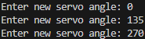

0 degrees

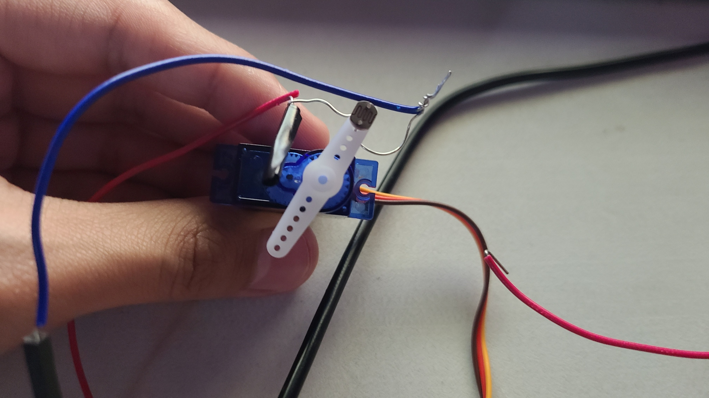

135 degrees

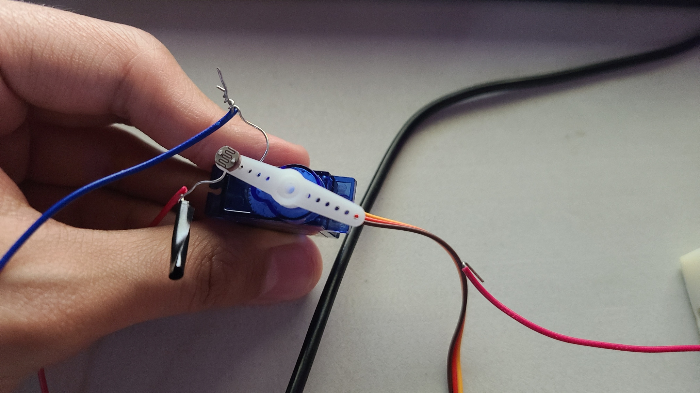

270 degrees

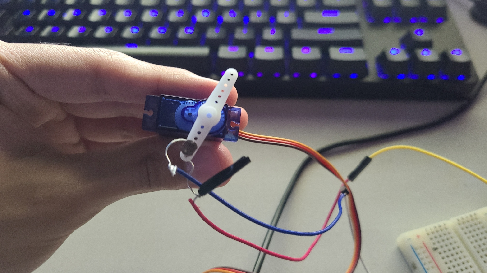

<br>

## 6) sensor.py
### **Program**
```py
from machine import ADC, Pin

class LightSensor():
    """Light Sensor"""

    _V_REF = 3.3
    _MAX_U16 = (2 ** 16) - 1

    _V_FACTOR = _V_REF / _MAX_U16

    def __init__(self, adc_pin: int):
        """
        Initialize the LightSensor object

        :param int adc_port: The light sensor's corresponding ADC pin
        """
        self._adc = ADC(Pin(adc_pin, Pin.IN))

    def read_voltage(self) -> float:
        """Return the ADC voltage as a float"""
        return (self._adc.read_u16() * self._V_FACTOR)

if __name__ == "__main__":
    """Test Script"""
    light_sensor = LightSensor(adc_pin=28)
    print(light_sensor.read_voltage())
```

<br>

### **Test**

High brightness

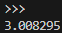

Low brightness

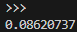

<br>

## 7) main.py
```py
import time
from servo import ServoMotor
from sensor import LightSensor

LDR_ADC_GPIO = 28
SERVO_PWM_GPIO = 22
SERVO_SPEED_HZ = 50
ANGLE_RES = 15

if __name__ == "__main__":
    light_sensor = LightSensor(adc_pin=LDR_ADC_GPIO)
    servo_motor = ServoMotor(pwm_gpio=SERVO_PWM_GPIO)
    servo_motor.set_speed(SERVO_SPEED_HZ)
    angle = ServoMotor.MIN_ANGLE
    highest_voltage = 0

    # Delay to grab the motor so it doesn't fly off
    time.sleep(3)

    while angle <= ServoMotor.MAX_ANGLE:
        servo_motor.set_angle(angle)
        time.sleep_ms(500)
        voltage = light_sensor.read_voltage()
        print("Angle: {} deg, Voltage: {:.2f}V".format(angle, voltage))

        # Pull-up LDR
        if voltage > highest_voltage:
            highest_voltage = voltage
            best_angle = angle
        angle += ANGLE_RES
    
    servo_motor.set_angle(best_angle)
    print("Optimal angle: {}".format(best_angle))
    
    # Delay long enough for the servo to move into place
    time.sleep_ms(500)
```

<br>

## 8) Demo

[https://www.youtube.com/watch?v=q1LSLCLQsbs](https://www.youtube.com/watch?v=q1LSLCLQsbs)

Click image to access video

[](https://www.youtube.com/watch?v=q1LSLCLQsbs)

Output

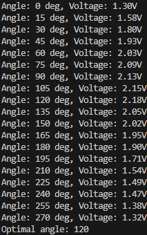
