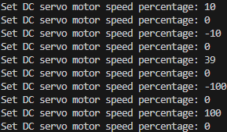

# Motor Speed
## 1) DC Servo Motor
### motor.py
```py
from machine import PWM, Pin

class UnidirectionalMotor():
    """Unidirectional Motor"""

    MIN_SPEED_PCT = const(0)
    MAX_SPEED_PCT = const(100)
    MIN_DUT_CYCLE_PCT = const(50)
    SEC_TO_NS_FLOAT = const(1_000_000_000)
    PWM_FREQ = const(20_000)
    PWM_PERIOD_NS = SEC_TO_NS_FLOAT / PWM_FREQ
    PWM_FACTOR = float(PWM_PERIOD_NS / (MAX_SPEED_PCT - MIN_DUT_CYCLE_PCT))
    PWM_OFFSET = round((float(MIN_DUT_CYCLE_PCT / MAX_SPEED_PCT)) * PWM_PERIOD_NS)
    
    def __init__(self, pwm_gpio: int):
        self._pwm = PWM(Pin(pwm_gpio, Pin.OUT))
        self._pwm.duty_ns(0)
        self._pwm.freq(self.PWM_FREQ)

    def set_speed_pct(self, speed_pct: int):
        if not (self.MIN_SPEED_PCT <= speed_pct <= self.MAX_SPEED_PCT):
            raise ValueError("Invalid unidirectional speed percentage: {}, must be within {} and {} inclusive.".format(speed_pct, self.MIN_SPEED_PCT, self.MAX_SPEED_PCT))
        
        # DC motor doesn't spin below 50% duty cycle
        # Current work around is to scale and offset it
        self._pwm.duty_ns(round(speed_pct * self.PWM_FACTOR) + self.PWM_OFFSET)
    
    def turn_off(self):
        self._pwm.duty_ns(0)

class BidirectionalMotor():
    """Bidirectional Motor"""
    MIN_BI_SPEED_PCT = -UnidirectionalMotor.MAX_SPEED_PCT
    MAX_BI_SPEED_PCT = UnidirectionalMotor.MAX_SPEED_PCT
    
    def __init__(self, cw_gpio: int, ccw_gpio: int):
        self._cw = UnidirectionalMotor(pwm_gpio=cw_gpio)
        self._ccw = UnidirectionalMotor(pwm_gpio=ccw_gpio)

    def set_speed_pct(self, speed_pct: int):
        if not (self.MIN_BI_SPEED_PCT <= speed_pct <= self.MAX_BI_SPEED_PCT):
            raise ValueError("Invalid bidirectional speed percentage: {}, must be within {} and {} inclusive.".format(speed_pct, self.MIN_BI_SPEED_PCT, self.MAX_BI_SPEED_PCT))

        if speed_pct < 0:
            self._cw.turn_off()
            self._ccw.set_speed_pct(abs(speed_pct))
        else:
            self._ccw.turn_off()
            self._cw.set_speed_pct(speed_pct)

if __name__ == "__main__":
    """Test Script"""
    motor = BidirectionalMotor(cw_gpio=16, ccw_gpio=17)
    while (True):
        motor.set_speed_pct(int(input("Set DC servo motor speed percentage: ".format(motor.MIN_BI_SPEED_PCT, motor.MAX_BI_SPEED_PCT))))
```

<br>

### Test

[https://www.youtube.com/watch?v=yeHlnZJ59TY](https://www.youtube.com/watch?v=yeHlnZJ59TY)

Click image to access video

[](https://www.youtube.com/watch?v=yeHlnZJ59TY)

Input values from video
<br>


## 2) joystick.py
```py
from machine import ADC, Pin
from motor import BidirectionalMotor

_MAX_U16 = const((2 ** 16) - 1)
_JS_FACTOR = (BidirectionalMotor.MAX_BI_SPEED_PCT - BidirectionalMotor.MIN_BI_SPEED_PCT) / _MAX_U16

class Joystick():
    """Joystick"""
    def __init__(self, adc_port):
        self._adc = ADC(adc_port)

    def read(self) -> int:
        value = round((self._adc.read_u16() * _JS_FACTOR) + BidirectionalMotor.MIN_BI_SPEED_PCT)
        return (max(min(value, BidirectionalMotor.MAX_BI_SPEED_PCT), BidirectionalMotor.MIN_BI_SPEED_PCT))
```

<br>

## 3) lcd.py
```py
import st7796 #Professor Glower's st7796 driver, renamed for clarity
from motor import BidirectionalMotor

_RGB_BLACK = st7796.RGB(0,0,0)
_RGB_WHITE = st7796.RGB(255, 255, 255)
_GRAPHIC_BAR_X1 = const(220)
_GRAPHIC_BAR_X2 = const(260)
_GRAPHIC_BAR_Y1 = const(160)
_GRAPHIC_BAR_Y2_MIN = _GRAPHIC_BAR_Y1-BidirectionalMotor.MIN_BI_SPEED_PCT
_GRAPHIC_BAR_Y2_MAX = _GRAPHIC_BAR_Y1-BidirectionalMotor.MAX_BI_SPEED_PCT

def init_display():
    st7796.Init()
    st7796.Clear(_RGB_BLACK)

def update_display_value(value: int):
    y2 = _GRAPHIC_BAR_Y1-value
    if value > 0:
        st7796.Solid_Box(_GRAPHIC_BAR_X1, _GRAPHIC_BAR_Y1, _GRAPHIC_BAR_X2, _GRAPHIC_BAR_Y2_MIN, _RGB_BLACK)
        st7796.Solid_Box(_GRAPHIC_BAR_X1, y2, _GRAPHIC_BAR_X2, _GRAPHIC_BAR_Y2_MAX, _RGB_BLACK)
    else:
        st7796.Solid_Box(_GRAPHIC_BAR_X1, _GRAPHIC_BAR_Y1, _GRAPHIC_BAR_X2, _GRAPHIC_BAR_Y2_MAX, _RGB_BLACK)
        st7796.Solid_Box(_GRAPHIC_BAR_X1, y2, _GRAPHIC_BAR_X2, _GRAPHIC_BAR_Y2_MIN, _RGB_BLACK)
    st7796.Solid_Box(_GRAPHIC_BAR_X1, _GRAPHIC_BAR_Y1, _GRAPHIC_BAR_X2, y2, _RGB_WHITE)
```

<br>

## 4) main.py
```py
from joystick import Joystick
from lcd import init_display, update_display_value
from motor import BidirectionalMotor

ADC_PORT = const(1)

PWM_CW_GPIO = const(16)
PWM_CCW_GPIO = const(17)

if __name__ == "__main__":
    joystick = Joystick(adc_port=ADC_PORT)
    motor = BidirectionalMotor(cw_gpio=PWM_CW_GPIO, ccw_gpio=PWM_CCW_GPIO)
    init_display()
    while (True):
        js_value = joystick.read()
        motor.set_speed_pct(js_value)
        update_display_value(js_value)
```

<br>

## 5) Demo

[https://www.youtube.com/watch?v=cASEnFwoj9U](https://www.youtube.com/watch?v=cASEnFwoj9U)

Click image to access video

[](https://www.youtube.com/watch?v=cASEnFwoj9U)