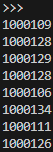
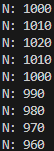

# Metronome
## 1) beep.py
### Program
```py
from machine import Pin, PWM, Timer
from time import ticks_us

_DUTY_ON_U16 = round(((2 ** 16) - 1) / 2)
_DUTY_OFF_U16 = const(0)

class Beeper:
    def __init__(self, quiet_period_ms: int, beep_length_ms: int, beep_freq: int, beep_gpio: int):
        self.quiet_period_ms = quiet_period_ms
        self._beep_length_ms = beep_length_ms
        self._pwm = PWM(Pin(beep_gpio, Pin.OUT), freq=beep_freq, duty_u16=_DUTY_OFF_U16)
        self._timer = Timer(-1)
        self._timer.init(mode=Timer.ONE_SHOT, period=self.quiet_period_ms, callback=self._start_beep_handler)

    def _start_beep_handler(self, timer: Timer):
        self._pwm.duty_u16(_DUTY_ON_U16)
        timer.init(mode=Timer.ONE_SHOT, period=self._beep_length_ms, callback=self._stop_beep_handler)

    def _stop_beep_handler(self, timer: Timer):
        self._pwm.duty_u16(_DUTY_OFF_U16)
        timer.init(mode=Timer.ONE_SHOT, period=self.quiet_period_ms, callback=self._start_beep_handler)

if __name__ == "__main__":
    """Rough test script for measuring quiet period between beeps"""
    beeper = Beeper(quiet_period_ms=1000, beep_length_ms=10, beep_freq=500, beep_gpio=28)
    got_start_ticks = False
    got_stop_ticks = False
    while (True):
        if ((beeper._pwm.duty_u16() == 0) and (not got_start_ticks)):
            start_ticks_us = ticks_us()
            got_start_ticks = True
            got_stop_ticks = False

        elif ((beeper._pwm.duty_u16() != 0) and (not got_stop_ticks)):
            print(ticks_us()-start_ticks_us)
            got_stop_ticks = True
            got_start_ticks = False
```

<br>

### Test

Roughly 1000ms quiet period between beeps



<br>

## 2) beep_incrementer.py
### Program
```py
from machine import Pin
from beep import Beeper

class BeepIncrementer:
    def __init__(self, beeper: Beeper, incr_pct: int, incr_gpio: int, decr_gpio: int, pull_config: int):
        self._beeper = beeper
        self._quiet_incr = round(beeper.quiet_period_ms * incr_pct / 100.0)
        self._increment = Pin(incr_gpio, Pin.IN, pull_config)
        self._decrement = Pin(decr_gpio, Pin.IN, pull_config)
        
        if pull_config == Pin.PULL_UP:
            edge_config = Pin.IRQ_FALLING
        elif pull_config == Pin.PULL_DOWN:
            edge_config = Pin.IRQ_RISING
        else:
            raise ValueError("Invalid pull configuration, must be {} or {}".format(Pin.IRQ_RISING, Pin.IRQ_FALLING))

        self._increment.irq(handler=self._increment_handler, trigger=edge_config)
        self._decrement.irq(handler=self._decrement_handler, trigger=edge_config)

    def _increment_handler(self, pin):
        self._beeper.quiet_period_ms += self._quiet_incr

    def _decrement_handler(self, pin):
        quiet_period_ms = self._beeper.quiet_period_ms - self._quiet_incr
        if quiet_period_ms >= 0:
            self._beeper.quiet_period_ms = quiet_period_ms

if __name__ == "__main__":
    beeper = Beeper(
        quiet_period_ms=1000, 
        beep_length_ms=10, 
        beep_freq=500, 
        beep_gpio=28
    )
    incrementer = BeepIncrementer(
        beeper=beeper, 
        incr_pct=1, 
        incr_gpio=15, 
        decr_gpio=14, 
        pull_config=Pin.PULL_UP
    )
    n = 0
    while (True):
        if n != beeper.quiet_period_ms:
            print("N: {}".format(beeper.quiet_period_ms))
        n=beeper.quiet_period_ms
```

<br>

### Test

Using GP14 to decrement and GP15 to increment



<br>

## 3)
### lcd.py
```py
import st7796 #Professor Glower's st7796 driver, renamed for clarity
from beep import Beeper

_RGB_BLACK = st7796.RGB(0,0,0)
_RGB_WHITE = st7796.RGB(255, 255, 255)
_MINUTE_TO_MS = const(60_000)
_BPM_LABEL = const("BPM: ")
_LABEL_X = const(120)
_X_TEXT = const(200)
_Y_TEXT = const(160)

class LCD:
    def __init__(self, beeper: Beeper):
        self._beeper = beeper
        self._current_bpm = ""
        st7796.Init()
        st7796.Clear(_RGB_BLACK)
        st7796.Text2(_BPM_LABEL, _LABEL_X, _Y_TEXT, _RGB_WHITE, _RGB_BLACK)

    def update_display(self):
        quiet_period_ms = self._beeper.quiet_period_ms
        if quiet_period_ms > 0:
            bpm = str(round(_MINUTE_TO_MS / quiet_period_ms))
        else:
            bpm = "Inf"

        if self._current_bpm != bpm:
            clear_string = " " * len(self._current_bpm)
            st7796.Text2(clear_string, _X_TEXT, _Y_TEXT, _RGB_WHITE, _RGB_BLACK)
            st7796.Text2(bpm, _X_TEXT, _Y_TEXT, _RGB_WHITE, _RGB_BLACK)

        self._current_bpm = bpm
```

<br>

### main.py
```py
from beep import Beeper
from beep_incrementer import BeepIncrementer
from lcd import LCD
from machine import Pin

if __name__ == "__main__":
    beeper = Beeper(
        quiet_period_ms=1000, 
        beep_length_ms=10, 
        beep_freq=500, 
        beep_gpio=28
    )

    incrementer = BeepIncrementer(
        beeper=beeper, 
        incr_pct=1, 
        incr_gpio=15, 
        decr_gpio=14, 
        pull_config=Pin.PULL_UP
    )

    lcd = LCD(beeper=beeper)

    while (True):
        lcd.update_display()
```