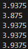

# Coffee Cup Tester
## 1) sensor.py
### Program
```py
import onewire
from ds18x20 import DS18X20
from machine import Pin
from time import sleep_ms

_ONEWIRE_GPIO = const(4)

class Sensor:
    def __init__(self, onewire_gpio: int):
        self._ds18b20 = DS18X20(onewire.OneWire(Pin(onewire_gpio)))
        addresses = self._ds18b20.scan()
        self._address = addresses[0]

        print('Found DS devices: {}'.format(addresses))
        print('Using address: {}'.format(self._address))

    def read_temp(self):
        self._ds18b20.convert_temp()
        sleep_ms(750)
        
        return self._ds18b20.read_temp(self._address)

if __name__ == "__main__":
    """Problem 1"""
    sensor = Sensor(onewire_gpio=_ONEWIRE_GPIO)

    while True:
        print(sensor.read_temp())
```

### Test

Cold water


<br>

Freezing water



<br>

Hot water


<br>

Ambient temperature


<br>

## 2) sensor_record.py
### Program
```py
import st7796
from machine import Timer
from sensor import Sensor

_ONEWIRE_GPIO = const(4)
_SAMPLE_PERIOD_MS = const(1000)
_NUM_SAMPLES = const(120)

_BLUE_RGB = st7796.RGB(30, 144, 255)
_BLACK_RGB = st7796.RGB(0, 0, 0)
_WHITE_RGB = st7796.RGB(255,255,255)

_YMIN = const(10)
_YMAX = const(210)
_Y0 = ((_YMAX - _YMIN) / 2) + _YMIN
_XMIN = const(50)

class SensorRecord:
    def __init__(self, onewire_gpio: int, sample_period_ms: int, num_samples: int):
        self._sensor = Sensor(onewire_gpio=onewire_gpio)
        self._max_sample_index = num_samples-1
        self.init_display()
        self._timer = Timer(-1)
        self._timer.init(mode=Timer.PERIODIC, period=sample_period_ms, callback=self._sensor_handler)
        self._samples_deg_c = []
        self._sample_index = 0
        self.is_recording = True

    def init_display(self):
        st7796.Init()
        st7796.Clear(_BLACK_RGB)
        st7796.Line(_XMIN, _Y0, _XMIN+self._max_sample_index, _Y0, _WHITE_RGB)
        st7796.Line(_XMIN, _YMIN, _XMIN, _YMAX, _WHITE_RGB)

    def _sensor_handler(self, Timer: Timer):
        meas = self._sensor.read_temp()
        self._samples_deg_c.append(meas)

        # Graph point
        x = _XMIN+self._sample_index
        y = _Y0-round(meas)
        st7796.Pixel2(x, y, _BLACK_RGB)
        st7796.Pixel2(x, y, _BLUE_RGB)
        self._sample_index += 1

        # Stop recording if desired number of samples is reached
        if self._sample_index >= self._max_sample_index:
            self._timer.deinit()
            self.is_recording = False

    def export_data(self, filename: str):
        with open(filename, "w") as in_file:
            for sample in self._samples_deg_c:
                in_file.write(str(sample) + '\n')

        

if __name__ == "__main__":
    record = SensorRecord(onewire_gpio=_ONEWIRE_GPIO, sample_period_ms=_SAMPLE_PERIOD_MS, num_samples=_NUM_SAMPLES)

    # Record data
    while record.is_recording:
        continue

    # Export data
    record.export_data(filename="samples.txt")
```

### Test

120 samples over 2 minutes


<br>

## 3) least_squares.m
### MATLAB Script
```
% Using exported data
temp = data;
time = [1:length(data)];
t_amb = 27.0;
b_matrix = [];
for i = 1:length(data)
    b_matrix = [b_matrix; [time(i), 1]];
end

a_matrix = inv(b_matrix'*b_matrix)*b_matrix'*log(temp - t_amb);
ttc = -1/a_matrix(1)
b = exp(a_matrix(2))
```

### Output


<br>

## 4) recursive_least_squares.py
### Program
```py
import matrix
import math
from machine import Timer
from sensor import Sensor

_ONEWIRE_GPIO = const(4)
_SAMPLE_PERIOD_MS = const(1000)
_T_AMB_C = const(27.0)

class SensorLeastSquares:
    def __init__(self, onewire_gpio: int, sample_period_ms: int, t_amb_c: float):
        self._sensor = Sensor(onewire_gpio=onewire_gpio)
        self._sample_period_s = sample_period_ms/1000
        self._t_amb_c = t_amb_c
        self._b_matrix =  [[0.01,0],[0,0.01]]
        self._y_matrix = [[0],[0]]
        self._x = 0
        self._timer = Timer(-1)
        self._timer.init(mode=Timer.PERIODIC, period=sample_period_ms, callback=self._sensor_handler)
        
    def _sensor_handler(self, timer: Timer):
        temp_c = self._sensor.read_temp()

        self._x += self._sample_period_s
        y = math.log(temp_c - self._t_amb_c)

        b_matrix = matrix.add(self._b_matrix, [[self._x*self._x, self._x], [self._x, 1]])
        y_matrix = matrix.add(self._y_matrix, [[self._x*y], [y]])
        b_matrix_inverse = matrix.inv(b_matrix)
        a_matrix = matrix.mult(b_matrix_inverse, y_matrix)
        a = abs(a_matrix[0][0])
        b = math.exp(a_matrix[1][0])
        tc = 1/a
        self._b_matrix = b_matrix
        self._y_matrix = y_matrix
        print("Current Temp: {}".format(temp_c))
        print("Time: {}\na: {}\nb: {}\nTC: {}".format(self._x, a, b, tc))

if __name__ == "__main__":
    least_squares = SensorLeastSquares(onewire_gpio=_ONEWIRE_GPIO, sample_period_ms=_SAMPLE_PERIOD_MS, t_amb_c=_T_AMB_C)

    while True:
        continue
```

<br>

## 5) Recursive Least Squares
### Recordings


### 90% Confidence Interval (MATLAB Script)
#### ttc.m
```m
ttc_data = [937.4318, 894.8087, 957.1939];

ttc_mean = mean(ttc_data);
ttc_std = std(ttc_data);

% 90% confidence interval w/ 2 DoF

ttc_mean + 2.920*ttc_std
ttc_mean - 2.920*ttc_std
```

#### Output

90% confidence interval:

836.71 and 1023 seconds

