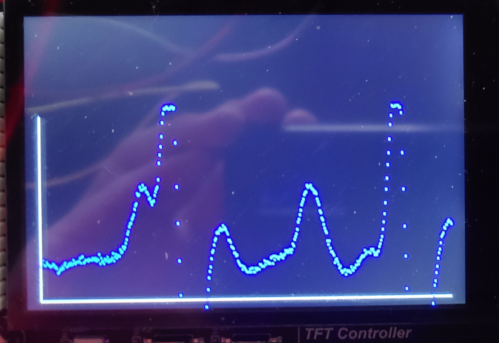
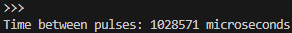
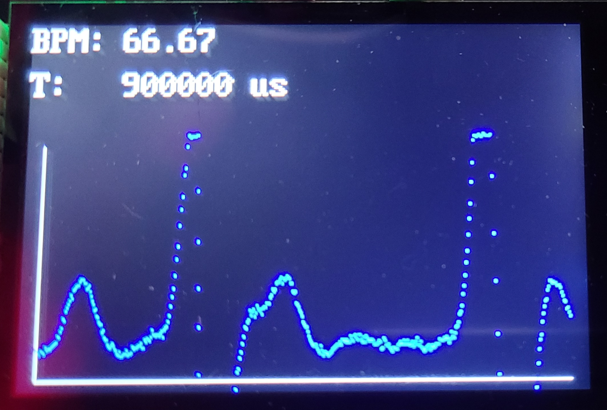
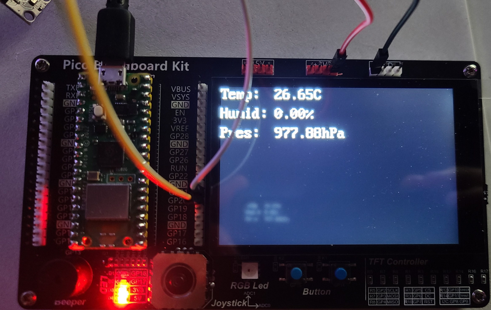
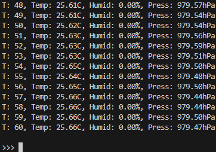
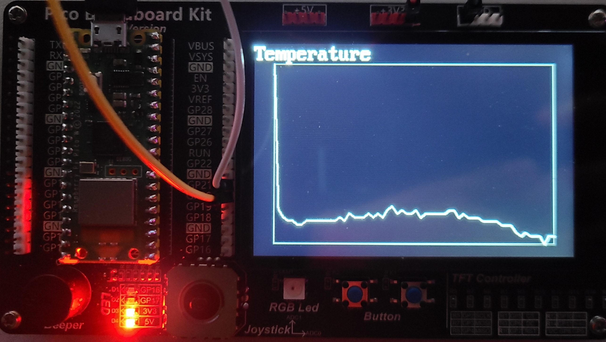
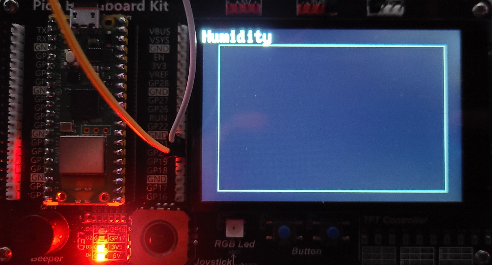
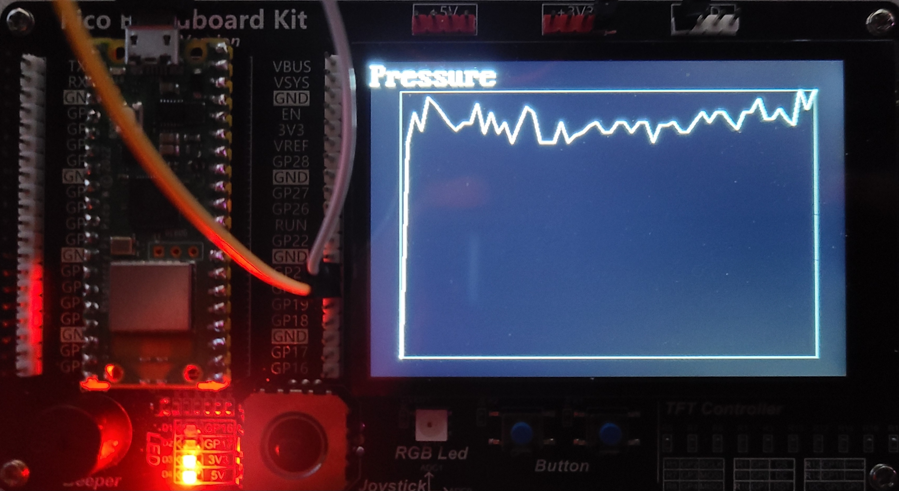

# Heart Sensor
## beep.py
```py
from machine import PWM, Pin, Timer

_DUTY_ON_U16 = const(32768)
_FREQ_HZ = 100

class Beeper:
    def __init__(self, beeper_gpio: int, beep_period_ms: int, led_gpio: int):
        self._beep_period_ms = beep_period_ms
        self._pwm = PWM(Pin(beeper_gpio, Pin.OUT))
        self._pwm.freq(_FREQ_HZ)
        self._pwm.duty_u16(0)
        self._led = Pin(led_gpio, Pin.OUT)
        self._timer = Timer(-1)
        self.is_beeping = False

    def start_beep(self):
        self.is_beeping = True
        self._pwm.duty_u16(_DUTY_ON_U16)
        self._led.value(1)
        self._timer.init(mode=Timer.ONE_SHOT, period=self._beep_period_ms, callback=self._stop_beep_handler)

    def _stop_beep_handler(self, timer: Timer):
        self._pwm.duty_u16(0)
        self._led.value(0)
        self.is_beeping = False
```

<br>

## lcd.py
```py
import st7796 #Professor Glower's st7796 driver, renamed for clarity

_RGB_BLUE = st7796.RGB(30, 144, 255)
_RGB_BLACK = st7796.RGB(0, 0, 0)
_RGB_WHITE = st7796.RGB(255,255,255)

_BPM_LABEL = "BPM: "
_BPM_LABEL_X = const(0)
_BPM_Y = const(320)
_BPM_X = _BPM_LABEL_X + 80

_T_LABEL = "T: "
_T_LABEL_X = const(0)
_T_Y = const(280)
_T_X = _T_LABEL_X + 80

_Y_RES = const(320)
_YMIN = const(10)
_YMAX = const(210)
_XMIN = const(15)
NUM_DISPLAY_SAMPLES = const(450)
_XMAX = _XMIN + NUM_DISPLAY_SAMPLES - 1
_MAX_ADC = const(62500)
_MIN_ADC = const(18000)
_SCALE_FACTOR = (_YMAX - _YMIN) / (_MAX_ADC - _MIN_ADC)

class LCD:
    def __init__(self):
        self._bpm_enabled = False
        self._pulse_period_enabled = False
        self._graph_enabled = False
        st7796.Init()
        st7796.Clear(_RGB_BLACK)

    def init_graph(self):
            st7796.Line(_XMIN, (_Y_RES - _YMIN), _XMAX, (_Y_RES - _YMIN), _RGB_WHITE)
            st7796.Line(_XMIN, (_Y_RES - _YMIN), _XMIN, (_Y_RES - _YMAX), _RGB_WHITE)
            self._graph_enabled = True

    def graph_samples(self, samples_u16: list[int]):
        if self._graph_enabled:
            num_samples = len(samples_u16)
            for i in range(0, num_samples):
                x = _XMIN+i
                y = ((samples_u16[i] - _MIN_ADC) * _SCALE_FACTOR)
                y += _YMIN
                st7796.Pixel2(x, (_Y_RES - y), _RGB_BLUE)

    def init_bpm(self):
        st7796.Text2(_BPM_LABEL, _BPM_LABEL_X, (_Y_RES - _BPM_Y), _RGB_WHITE, _RGB_BLACK)
        self._bpm_enabled = True
        
    def set_bpm(self, bpm: float):
        if self._bpm_enabled:
            bpm_string = "{:.2f}".format(bpm)
            st7796.Text2(bpm_string, _BPM_X, (_Y_RES - _BPM_Y), _RGB_WHITE, _RGB_BLACK)

    def init_pulse_period(self):
        st7796.Text2(_T_LABEL, _T_LABEL_X, (_Y_RES - _T_Y), _RGB_WHITE, _RGB_BLACK)
        self._pulse_period_enabled = True

    def set_pulse_period(self, period_us: int):
        if self._pulse_period_enabled:
            period_us_string = "{} us".format(period_us)
            st7796.Text2(period_us_string, _T_X, (_Y_RES - _T_Y), _RGB_WHITE, _RGB_BLACK)
```

<br>

## sensor.py
```py
import math
from machine import ADC, Pin, Timer
from lcd import NUM_DISPLAY_SAMPLES

_BEAT_ADC_THRESHOLD = const(60_000)
_SAMPLE_PERIOD_MS = const(1_000)

class HeartSensor:
    def __init__(self, adc_gpio: int, duration_ms: int, display=None, beeper=None, print_pulse_period: bool=False):
        self._adc = ADC(Pin(adc_gpio, Pin.IN))
        self.enabled = True
        self._beat_occurring = False
        self._beats = 0
        self._ticks_ms = 0
        self._debounce_counter = 35
        self._duration_ms = duration_ms
        self._display = display
        
        if self._display != None:
            self._samples = []
            self._sample_counter = 0
            self._sample_interval = math.ceil(self._duration_ms / NUM_DISPLAY_SAMPLES)

        self._beeper = beeper
        self._print_pulse_period = print_pulse_period

        self._beeper = beeper
        self._timer = Timer(-1)
        self._timer.init(mode=Timer.PERIODIC, freq=_SAMPLE_PERIOD_MS, callback=self._adc_handler)
    
    def _adc_handler(self, timer: Timer):
        self._ticks_ms += 1
        meas = self._adc.read_u16()
        
        if self._display != None:
            self._sample_counter = (self._sample_counter + 1) % self._sample_interval
            if self._sample_counter == 0:
                self._samples.append(meas)
        
        if meas > _BEAT_ADC_THRESHOLD:
            if not self._beat_occurring:
                self._beats += 1
                self._beat_occurring = True

                if (self._beeper != None) and (not self._beeper.is_beeping):
                    self._beeper.start_beep()

        elif self._beat_occurring:
            self._debounce_counter -= 1
            if self._debounce_counter == 0:
                self._beat_occurring = False
                self._debounce_counter = 35
        
        if self._ticks_ms >= self._duration_ms:
            self._timer.deinit()
            pulse_period_us = round(self._ticks_ms * 1000 / self._beats)

            if self._print_pulse_period:
                print("Time between pulses: {} microseconds".format(pulse_period_us))

            if self._display != None:
                bpm = (self._beats / (self._duration_ms / 1000)) * 60
                self._display.set_bpm(bpm=bpm)
                self._display.set_pulse_period(period_us=pulse_period_us)
                self._display.graph_samples(samples_u16=self._samples)

            self.enabled = False
```

## 1)
### main.py
```py
from sensor import HeartSensor
from lcd import LCD

if __name__ == "__main__":
    display = LCD()
    display.init_graph()
    
    heart_sensor = HeartSensor(adc_gpio=28, duration_ms=1_800, display=display)
    while heart_sensor.enabled:
        continue
```

<br>

## Result



<br>

## 2)
### main.py
```py
from beep import Beeper
from sensor import HeartSensor

if __name__ == "__main__":
    beeper = Beeper(beeper_gpio=28, beep_period_ms=100, led_gpio=16)

    heart_sensor = HeartSensor(adc_gpio=28, duration_ms=1_800, beeper=beeper)
    while heart_sensor.enabled:
        continue
```

<br>

## 3)
### main.py
```py
from sensor import HeartSensor

if __name__ == "__main__":

    heart_sensor = HeartSensor(adc_gpio=28, duration_ms=7_200, print_pulse_period=True)
    while heart_sensor.enabled:
        continue
```

<br>

### Result



<br>

## 4)
### main.py
```py
from sensor import HeartSensor
from lcd import LCD

if __name__ == "__main__":
    display = LCD()
    display.init_graph()
    display.init_bpm()
    display.init_pulse_period()
    heart_sensor = HeartSensor(adc_gpio=28, duration_ms=1_800, display=display)
    while heart_sensor.enabled:
        continue
```

<br>

### Result



<br>

## 5) Demo
### main.py
```
from beep import Beeper
from sensor import HeartSensor
from lcd import LCD

if __name__ == "__main__":
    display = LCD()
    display.init_graph()
    display.init_bpm()
    display.init_pulse_period()

    beeper = Beeper(beeper_gpio=28, beep_period_ms=100, led_gpio=16)

    heart_sensor = HeartSensor(adc_gpio=28, duration_ms=1_800, display=display, beeper = beeper)
    
    while heart_sensor.enabled:
        continue
```

<br>

[https://www.youtube.com/watch?v=Utkp7kj1dlg](https://www.youtube.com/watch?v=Utkp7kj1dlg)

Click image to access video

[](https://www.youtube.com/watch?v=Utkp7kj1dlg)


<br>

# Weather Station
## lcd.py
```py
import st7796

_RGB_BLACK = st7796.RGB(0, 0, 0)
_RGB_WHITE = st7796.RGB(255,255,255)

_Y_RES = const(320)
_X = const(0)
_MEAS_X = _X + 110

_TEMP_LABEL = "Temp: "
_TEMP_LABEL_Y = _Y_RES - 320

_HUMID_LABEL = "Humid: "
_HUMID_LABEL_Y = _Y_RES - 280

_PRES_LABEL = "Pres: "
_PRES_LABEL_Y = _Y_RES - 240

_GRAPH_LABEL_X = const(0)
_GRAPH_LABEL_Y = _Y_RES - 320

def init(with_labels: bool=False):
    st7796.Init()
    st7796.Clear(_RGB_BLACK)

    if with_labels:
        st7796.Text2(_TEMP_LABEL, _X, _TEMP_LABEL_Y, _RGB_WHITE, _RGB_BLACK)
        st7796.Text2(_HUMID_LABEL, _X, _HUMID_LABEL_Y, _RGB_WHITE, _RGB_BLACK)
        st7796.Text2(_PRES_LABEL, _X, _PRES_LABEL_Y, _RGB_WHITE, _RGB_BLACK)        

def plot(data: list, graph_label: str):
    st7796.Clear(_RGB_BLACK)
    x = range(len(data))
    st7796.Text2(graph_label, _GRAPH_LABEL_X, _GRAPH_LABEL_Y, _RGB_WHITE, _RGB_BLACK)
    st7796.Plot(X=x, Y=data, Xmin=min(x), Ymin=min(data), Xmax=max(x), Ymax=max(data), color=_RGB_WHITE)

def update_values(temperature: str, humidity: str, pressure: str):
    st7796.Text2(temperature, _MEAS_X, _TEMP_LABEL_Y, _RGB_WHITE, _RGB_BLACK)
    st7796.Text2(humidity, _MEAS_X, _HUMID_LABEL_Y, _RGB_WHITE, _RGB_BLACK)
    st7796.Text2(pressure, _MEAS_X, _PRES_LABEL_Y, _RGB_WHITE, _RGB_BLACK)
```

<br>

# sensor.py
```py
import lcd
from machine import I2C, Pin, Timer
from bme280 import BME280

class EnvironmentSensor:
    def __init__(self, device_id: int, scl_gpio: int, scl_freq_hz: int, sda_gpio: int, sample_rate_hz: int, duration_s: int, display_data_to_lcd: bool=False, print_data: bool=False, graph_data: bool=False, button_gpio=None):
        self._i2c = I2C(id=device_id, scl=Pin(scl_gpio), sda=Pin(sda_gpio), freq=scl_freq_hz)
        self._bme = BME280(i2c=self._i2c)
        self._data = [[],[],[]]
        self._data_set_ptr = 0
        self._display_data_to_lcd = display_data_to_lcd
        self.done_collecting = False
        self._graph_data = graph_data
        self._graph_labels = ["Temperature", "Humidity", "Pressure"]
        self._time_s = 0
        self._print_data = print_data
        self._duration_s = duration_s
        lcd.init(with_labels=display_data_to_lcd)
        self._timer = Timer(-1)
        self._timer.init(mode=Timer.PERIODIC, freq=sample_rate_hz, callback=self._sample_handler)
        if (button_gpio != None) and (self._graph_data):
            self._button = Pin(button_gpio, Pin.IN, Pin.PULL_UP)
            self._button.irq(trigger=Pin.IRQ_FALLING, handler=self._switch_set_handler)

    def _sample_handler(self, timer: Timer):
        self._time_s += 1

        temperature = self._bme.temperature
        humidity = self._bme.humidity
        pressure = self._bme.pressure

        if self._display_data_to_lcd:
            lcd.update_values(temperature=temperature, humidity=humidity, pressure=pressure)

        self._data[0].append(int((temperature.replace(".", "")).strip("C")))
        self._data[1].append(int((humidity.replace(".", "")).strip("%")))
        self._data[2].append(int((pressure.replace(".", "")).strip("hPa")))

        if self._print_data:
            print("T: {}, Temp: {}, Humid: {}, Press: {}".format(
                self._time_s, 
                temperature, 
                humidity, 
                pressure
                )
            )

        if self._time_s >= self._duration_s:
            self._timer.deinit()
            self.done_collecting = True

            if self._graph_data:
                lcd.plot(self._data[self._data_set_ptr], self._graph_labels[self._data_set_ptr])


    def _switch_set_handler(self, pin: Pin):
        if self.done_collecting:
            self._data_set_ptr = (self._data_set_ptr + 1) % len(self._data)
            lcd.plot(self._data[self._data_set_ptr], self._graph_labels[self._data_set_ptr])
```
## 6) test.py
```py
from sensor import EnvironmentSensor

if __name__ == "__main__":
    sensor = EnvironmentSensor(
        device_id=0,
        scl_gpio=21,
        scl_freq_hz=10_000,
        sda_gpio=20,
        sample_rate_hz=1,
        duration=60,
        display_data_to_lcd=True,
        button_gpio=15
    )
    while True:
        continue
```

<br>



<br>

## 7) test.py
```py
from sensor import EnvironmentSensor

if __name__ == "__main__":
    sensor = EnvironmentSensor(
        device_id=0,
        scl_gpio=21,
        scl_freq_hz=10_000,
        sda_gpio=20,
        sample_rate_hz=1,
        duration_s=60,
        print_data=True,
        button_gpio=15
    )
    while not sensor.done_collecting:
        continue
```

<br>

Portion of the data



<br>

## 8) test.py
```py
from sensor import EnvironmentSensor

if __name__ == "__main__":
    sensor = EnvironmentSensor(
        device_id=0,
        scl_gpio=21,
        scl_freq_hz=10_000,
        sda_gpio=20,
        sample_rate_hz=1,
        duration_s=60,
        graph_data=True,
        button_gpio=15
    )
    while True:
        continue
```

<br>

Results

Temperature



<br>

Humidity (Zero)



<br>

Pressure



<br>