# RGB Controller
## Related Lectures
- Analog I/O
- Edge Interrupts
- LCD Graphic Display
- NeoPixels

<br>

## 1) Requirements
### Outputs
#### LCD
The LCD will display a box on a 12x8 grid. The box's vertical position will determine which NeoPixel is being currently set (8 vertical Positions for 8 NeoPixels) while the horizontal position will determine the intensity for that R,G, or B value. The box will also change color to match the color value that's being currently set (Red, Green, or Blue) for the selected NeoPixel.

#### NeoPixel
Each NeoPixel on the 1x8 strip will be individually RGB addressed based on the LCD box's Coordinates.

<br>

### Inputs
#### Button RGB
This button's falling edge IRQ will select a NeoPixel and cycle through each of its R, G, B value as it sets them in accordance with the box's coordinates.

#### Button Clear
This button's falling edge IRQ will clear all NeoPixel RGB values.

#### Analog Stick
The stick's ADCs will move the on-screen box's position in the vertical and horizontal direction.

<div style="page-break-after: always;"></div>

## 3) Flowchart & Program
### Flowchart
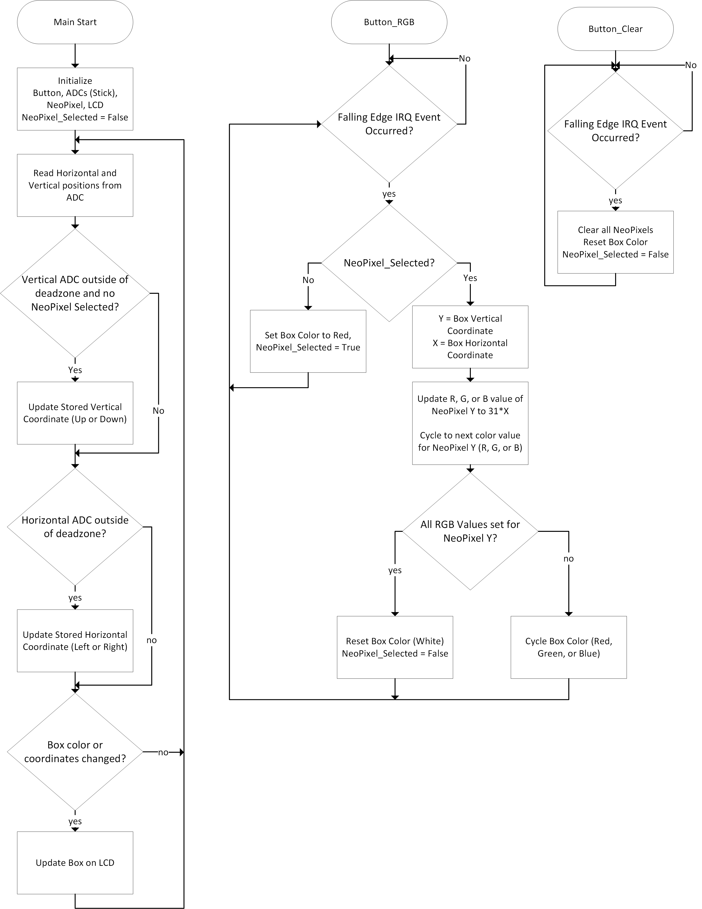

<div style="page-break-after: always;"></div>

### Program
#### lcd.py
```py
import st7796
from machine import ADC, Pin

CHUNKS = [[],[]]

for i in range(0, 12):
    CHUNKS[0].append(i*40)

for j in range (0, 8):
    CHUNKS[1].append(280 - (j*40))

RGB_VALUES = [st7796.RGB(255, 0, 0), st7796.RGB(0, 255, 0), st7796.RGB(0, 0, 255)]
DEFAULT_BOX_RGB = st7796.RGB(255, 255, 255)
BACKGROUND_RGB = st7796.RGB(0, 0, 0)

class LCD:
    def __init__(self, stick_x_gpio: int, stick_y_gpio: int):
        self._stick_x = ADC(Pin(stick_x_gpio, Pin.IN))
        self._stick_y = ADC(Pin(stick_y_gpio, Pin.IN))
        self._box_rgb = DEFAULT_BOX_RGB
        self._last_box_rgb = self._box_rgb
        self.box_pos = [0,0]
        self._box_last_pos = [0,1]
        self._box_moved = [False, False]
        self.vertically_constrained = False

    def init(self):
        st7796.Init()
        st7796.Clear(BACKGROUND_RGB)

    def tick(self):
        self._update_pos()
        self._update_lcd()

    def switch_box_rgb(self, pointer: int):
        self._last_box_rgb = self._box_rgb
        self._box_rgb = RGB_VALUES[pointer]

    def clear_box_rgb(self):
        self._last_box_rgb = self._box_rgb
        self._box_rgb = DEFAULT_BOX_RGB

    def _update_pos(self):
        input_x = self._stick_x.read_u16()
        input_y = self._stick_y.read_u16()
        hor_move = 0
        ver_move = 0
        if input_x > 55000:
            hor_move = 1
        elif input_x < 10535:
            hor_move = -1

        if not self.vertically_constrained:
            if input_y > 55000:
                ver_move = 1
            elif input_y < 10535:
                ver_move = -1

        if not self._box_moved[0]:
            self.box_pos[0] = min(max(self.box_pos[0] + hor_move, 0), 11)

        if not self._box_moved[1]:
            self.box_pos[1] = min(max(self.box_pos[1] + ver_move, 0), 7)

        self._box_moved[0] = bool(hor_move)
        self._box_moved[1] = bool(ver_move)

    def _update_lcd(self):
        if ((self.box_pos[0] != self._box_last_pos[0]) or (self.box_pos[1] != self._box_last_pos[1]) or (self._last_box_rgb != self._box_rgb)):
            st7796.Solid_Box(CHUNKS[0][self._box_last_pos[0]], CHUNKS[1][self._box_last_pos[1]], CHUNKS[0][self._box_last_pos[0]]+39, CHUNKS[1][self._box_last_pos[1]]+39, BACKGROUND_RGB)
            st7796.Solid_Box(CHUNKS[0][self.box_pos[0]], CHUNKS[1][self.box_pos[1]], CHUNKS[0][self.box_pos[0]]+39, CHUNKS[1][self.box_pos[1]]+39, self._box_rgb)
            
            if self._last_box_rgb != self._box_rgb:
                self._last_box_rgb = self._box_rgb

        self._box_last_pos[0] = self.box_pos[0]
        self._box_last_pos[1] = self.box_pos[1]

# Test script
if __name__ == "__main__":
    lcd = LCD(stick_x_gpio=26, stick_y_gpio=27)
    lcd.init()
    while True:
        try:
            lcd.tick()
        except KeyboardInterrupt:
            break
```

#### rgb.py
```py
from lcd import LCD
from machine import Pin
from neopixel import NeoPixel

RGB_STRING = "RGB"

class RGBController:
    def __init__(self, button_rgb: Pin, button_clear: Pin, neopixel: NeoPixel, lcd: LCD):
        self._neopixel = neopixel
        self._lcd = lcd
        self._rgb_pointer = 0
        self._np_selected = False
        self._current_rgb = [0, 0, 0]
        self._button_rgb = button_rgb
        self._button_clear = button_clear
        self._button_rgb.irq(handler=self._rgb_handler, trigger=Pin.IRQ_FALLING)
        self._button_clear.irq(handler=self._clear_handler, trigger=Pin.IRQ_FALLING)

    def _rgb_handler(self, pin: Pin):
        if not self._np_selected:
            self._lcd.switch_box_rgb(self._rgb_pointer)
            self._np_selected = True
            self._lcd.vertically_constrained = True
            print("Selected NeoPixel {}".format(self._lcd.box_pos[1]))
        else:
            self._current_rgb[self._rgb_pointer] = 23 * self._lcd.box_pos[0]
            self._neopixel[self._lcd.box_pos[1]] = tuple(self._current_rgb) #type: ignore
            self._neopixel.write()
            print("Set {} value to {}".format(RGB_STRING[self._rgb_pointer], self._current_rgb[self._rgb_pointer]))
            self._rgb_pointer = (self._rgb_pointer + 1) % 3

            if self._rgb_pointer == 0:
                self._np_selected = False
                self._lcd.vertically_constrained = False
                print("Set NeoPixel {} to RGB value {}".format(self._lcd.box_pos[1], self._current_rgb))
                self._lcd.clear_box_rgb()
                self._current_rgb = [0, 0, 0]
            else:
                self._lcd.switch_box_rgb(self._rgb_pointer)

    def _clear_handler(self, pin: Pin):
        self._np_selected = False
        self._lcd.vertically_constrained = False
        self._lcd.clear_box_rgb()
        self._rgb_pointer = 0
        self._current_rgb = [0, 0, 0]
        self._neopixel.fill((0,0,0))
        self._neopixel.write()
        print("All NeoPixels Cleared")
```

#### main.py
```py
from lcd import LCD
from neopixel import NeoPixel
from machine import Pin
from rgb import RGBController

if __name__ == "__main__":
    neopixel = NeoPixel(Pin(11), 8, bpp=3, timing=1)
    button_rgb = Pin(14, Pin.IN, Pin.PULL_UP)
    button_clear = Pin(15, Pin.IN, Pin.PULL_UP)
    lcd = LCD(stick_x_gpio=26, stick_y_gpio=27)
    strip = RGBController(button_rgb, button_clear, neopixel, lcd)
    lcd.init()
    while True:
        try:
            lcd.tick()
        except KeyboardInterrupt:
            break
```

<br>

## 4) Validation
### Test print statements for analog stick deadzone

Modification to lcd.py
```py
        if input_x > 55000:
            hor_move = 1
            print("To the right of deadzone: {}".format(input_x))
        elif input_x < 10535:
            hor_move = -1
            print("To the left of deadzone: {}".format(input_x))

        if not self.vertically_constrained:
            if input_y > 55000:
                ver_move = 1
                print("Above deadzone: {}".format(input_y))
            elif input_y < 10535:
                ver_move = -1
                print("Below deadzone: {}".format(input_y))
```

ADC1 above deadzone of 55000

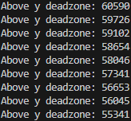

ADC1 below deadzone of 10535

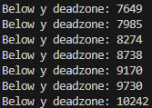

<br>

ADC0 right of deadzone of 55000

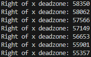

ADC0 left of deadzone of 10535

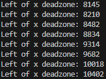

<br>

### Test NeoPixel RGB from LCD coordinates

Box Y coordinate 5 + Button Push = Select NeoPixel 5 (0 index)

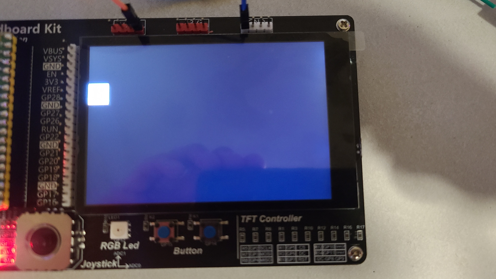

<br>

Once a NeoPixel is selected, box can't move vertically (as expected)

Box X coordinate 7 + Button Push = R value of 161 (7*23)

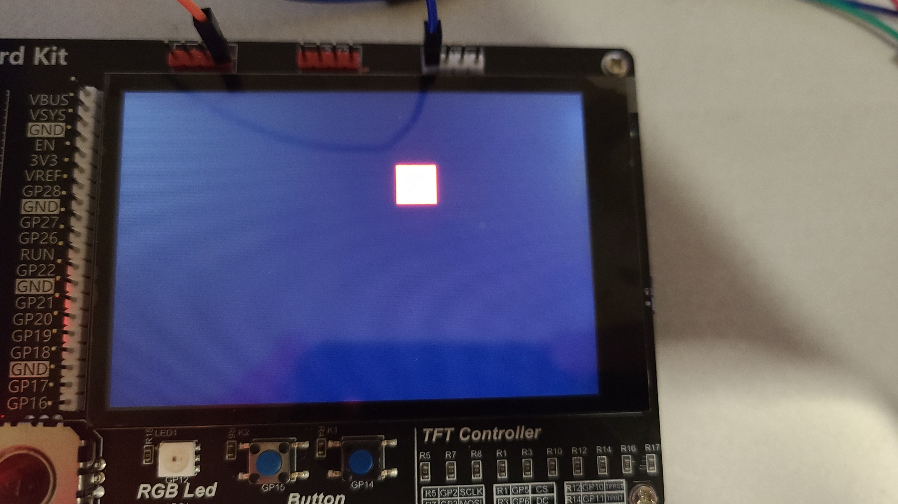

<br>

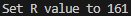

<br>

Box X coordinate 1 + Button Push = G value of 23 (1*23)

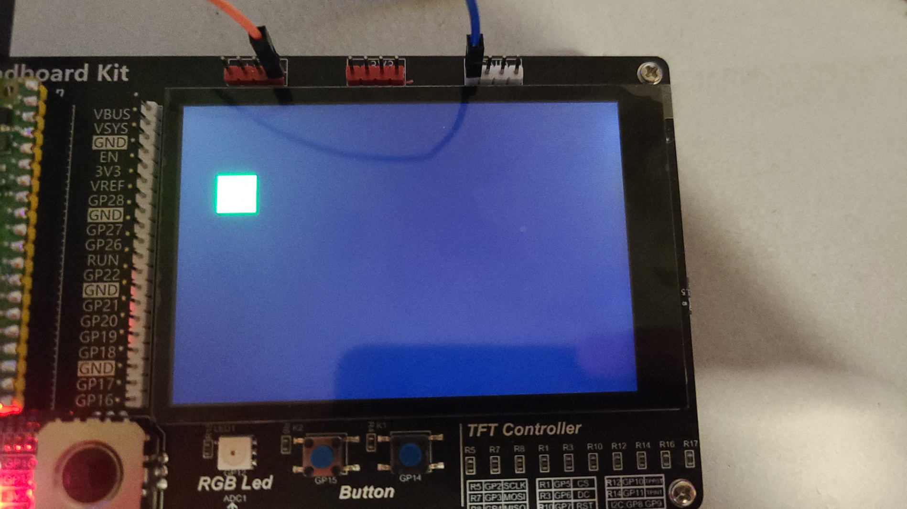

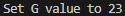

<br>

Box X coordinate 11 + Button Push = B value of 253 (11*23)

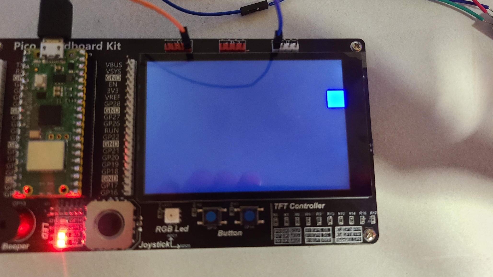

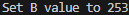

<br>

Purple

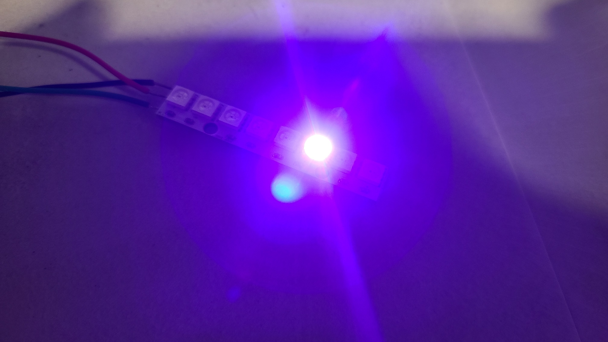

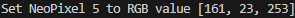

<br>

Box goes back to being white (expected)


<br>

Pushing the clear button clears all NeoPixels

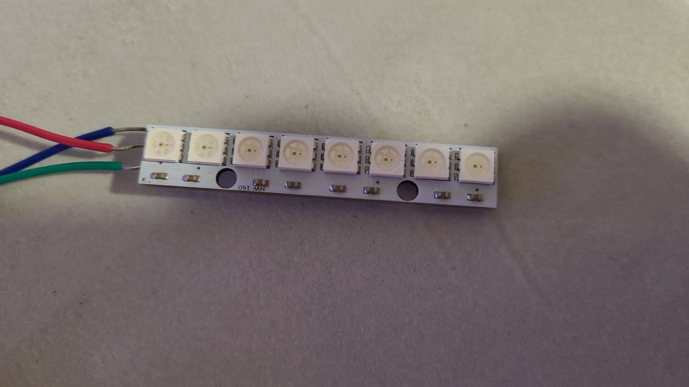

## 5) Demo

[https://www.youtube.com/watch?v=PfXG66XNrC0](https://www.youtube.com/watch?v=PfXG66XNrC0)

Click image to access video

[](https://www.youtube.com/watch?v=PfXG66XNrC0)